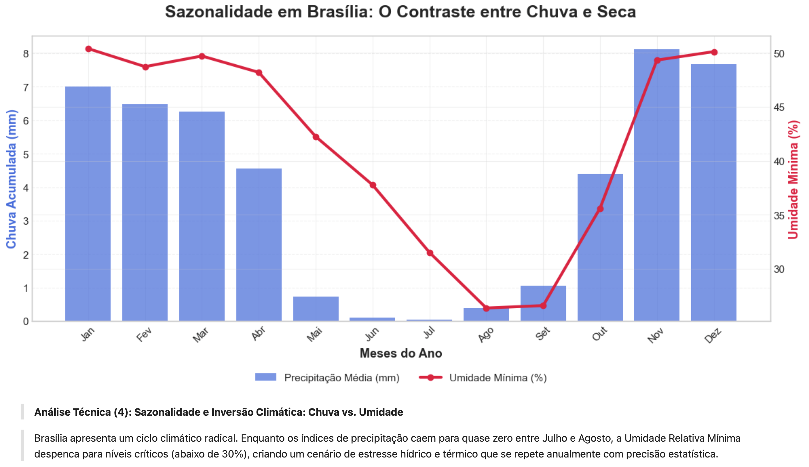
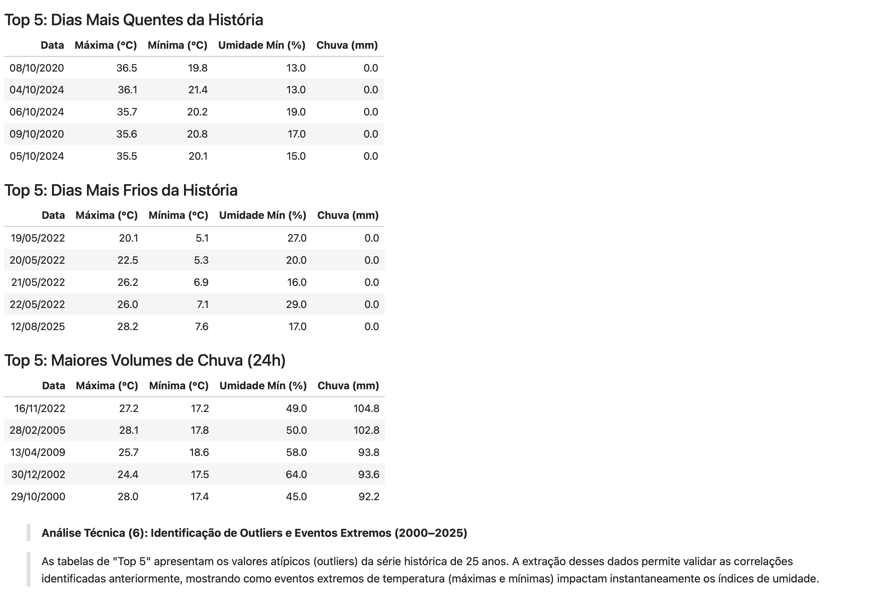
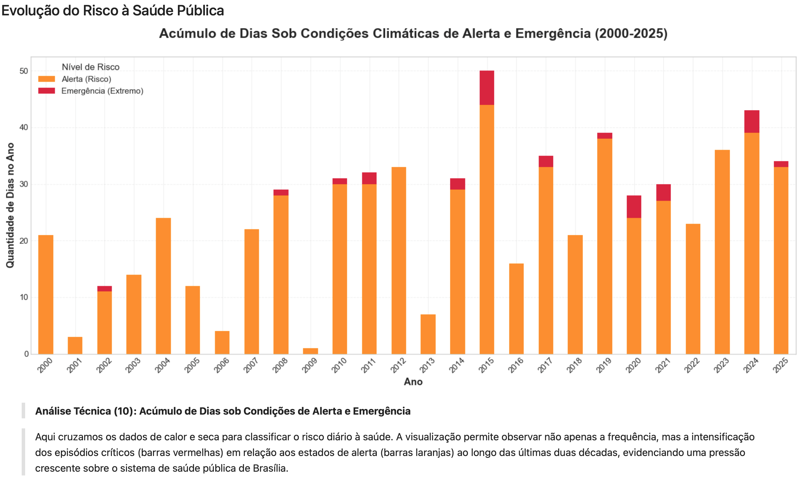

# Análise Climática de Brasília: 25 Anos de Extremos (2000 - 2025)

Projeto de análise exploratória e estatística focado na dinâmica climática e na identificação de eventos extremos no Distrito Federal.

**Principais temas abordados:**
- **Tendências de Aquecimento:** Evolução da temperatura média e máximas históricas.
- **Sazonalidade do Cerrado:** O contraste crítico entre os regimes de chuva e seca.
- **Engenharia de Dados:** Criação de um Índice de Conforto Térmico baseado em diretrizes de saúde pública.
- **Análise de Recorrência:** Estudo sobre o encurtamento dos intervalos de seca extrema (umidade ≤ 10%).

**Tecnologias:** Python, Pandas, Matplotlib, Seaborn, Jupyter Notebook

**Autor:** Pablo Torres  
Analista de Dados em formação avançada, com sólida base em tecnologia e especialização em inteligência de negócios.  

- Graduado em Sistemas de Informação  
- Pós-graduado em Big Data para Business Analytics e Business Intelligence  
- Atualmente no 3º semestre de Ciência de Dados e Inteligência Artificial

## 📑 Sumário
1. [Metodologia e Preparação de Dados](#-metodologia-e-preparação-de-dados)
2. [Insight 1: Variação Histórica da Temperatura](#insight-1-variação-histórica-da-temperatura-em-brasília-2000-2025)
3. [Insight 2: Evolução da Temperatura Média Anual](#insight-2-evolução-da-temperatura-média-anual-em-brasília-2000-2025)
4. [Insight 3: Sazonalidade — O Contraste entre Chuva e Seca](#insight-3-sazonalidade-em-brasília--o-contraste-radical-entre-chuva-e-seca)
5. [Insight 4: Dinâmica das Variáveis (Correlação)](#insight-4-dinâmica-das-variáveis-meteorológicas-2000---2025)
6. [Insight 5: Recordes e Eventos Extremos](#insight-5-recordes-e-eventos-extremos-2000---2025)
7. [Insight 6: Histórico de Emergência (Umidade ≤ 10%)](#insight-6-histórico-de-emergência---umidade-crítica--10)
8. [Insight 7: Diagnóstico de Conforto e Risco à Saúde](#insight-7-diagnóstico-de-conforto-e-risco-à-saúde-2000---2025)
9. [Insight 9: Evolução do Risco à Saúde Pública](#insight-9-a-evolução-do-risco-à-saúde-pública-20002025)
10. [Conclusão Final](#conclusão-final-brasília-2000--2025)
11. [Como rodar o projeto](#-como-rodar)

---
### Metodologia e Preparação de Dados


### Insight 1: Variação Histórica da Temperatura em Brasília (2000-2025)
**ANÁLISE DE TENDÊNCIA E AMPLITUDE TÉRMICA:**

Os **picos de maior tendência (calor)** no período são:

* **2016:** Consolidado como o ápice térmico da série histórica.
* **Final de 2024:** Nova ascensão térmica significativa.

Os **momentos de menor tendência (resfriamento)** no período são:

* **2004:** Período de estabilidade térmica com médias mais baixas.
* **Final de 2017:** Registro da queda mais acentuada na média móvel.


---

**DIAGNÓSTICO CLIMÁTICO:**

* **Aquecimento Gradual:** A linha de tendência em vermelho mostra que os picos de calor da última década superam consistentemente os registros do início dos anos 2000.

* **Amplitude Agressiva:** A vasta área cinza no gráfico representa a diferença entre mínimas e máximas. Brasília tem uma alta amplitude térmica.

* **Variabilidade Interanual:** A discrepância entre o pico de **2016** e a queda de **2017** demonstra que o clima do DF é sujeito a variações extremas em curtos intervalos de tempo.

* **Fator Global (El Niño):** O recorde térmico observado em 2016 está diretamente associado ao fenômeno Super El Niño, um dos mais intensos já registrados, que elevou as temperaturas globais

---

**AÇÃO ESTRATÉGICA:** Os dados indicam uma necessidade de políticas de **mitigação de calor urbano** e arborização, visto que as janelas de resfriamento estão se tornando mais curtas frente ao aumento da base térmica anual.

---

### Insight 2: Evolução da Temperatura Média Anual em Brasília (2000-2025)
**RESUMO DA TRAJETÓRIA TÉRMICA:**

* **Deslocamento da Base Térmica:** A média anual de Brasília subiu de **20,9°C** em 2000 para **21,8°C** em 2025.

* **Picos Históricos:** Os anos de **2015** e **2016** registraram as maiores médias da série, com **2016 ultrapassando** a marca dos **22°C**.

* **Período de Referência (Mínimas):** O intervalo entre **2000 e 2006** representou a fase mais amena da série, com médias em torno dos **21°C**.


---

**ANÁLISE ESTRATÉGICA E ANOMALIAS:**

* **Indicador de Mudança Climática:** O aumento real de **1,1°C** em apenas 25 anos serve como um forte indicativo local do impacto das mudanças climáticas globais sobre a Capital Brasileira.

* **Fator Global (El Niño):** A anomalia térmica observada em **2015-2016** está ligada diretamente El Niño, um dos fenômenos de mudança climatica de mais intensidade já documentados, que elevou as temperaturas médias em escala mundial.

* **Inconstância na Tendência:** Embora a **Tendência de Aquecimento** (linha tracejada vermelha) seja claramente ascendente, o gráfico revela que o aumento não é contínuo, apresentando ciclos de leve queda seguidos por novas altas.

---

**CONCLUSÃO:** O aumento de temperatura média anual reforça a urgência de adaptações urbanas para lidar com um cenário onde médias acima de **21,5°C** estão deixando de ser exceção para se tornarem o novo padrão.

---

### Insight 3: Sazonalidade em Brasília — O Contraste Radical entre Chuva e Seca
**RESUMO DO CICLO CLIMÁTICO (Média 25 anos):**

* **Transição Drástica:** Vemos uma queda abrupta na precipitação a partir de **maio**, marcando o início oficial do período de estiagem severa.

* **Pico de Estresse:** As chuvas chegam a níveis próximos de zero em **junho e julho**. Consequentemente, a umidade relativa do ar atinge seu ponto crítico em **agosto e setembro**, com médias em torno de **27**%.

* **Retomada das Chuvas:** O alívio climático inicia-se em **outubro**, com uma recuperação rápida tanto nos índices de chuva acumulada quanto da umidade mínima, demonstrando a dependência direta entre a chuva e o conforto térmico.



---

**ANÁLISE ESTRATÉGICA E SAZONAL:**

* **A Inversão Sazonal:** Brasília apresenta um ciclo radical onde a precipitação cai para quase zero enquanto a umidade despenca para níveis de deserto.

* **Efeito de Acúmulo Crítico:** O fato da umidade mínima ocorrer após o fim das chuvas cria um cenário de estresse hídrico e térmico acumulado que se repete com precisão estatística.

* **Sinal de Alerta:** O período entre agosto e setembro é o mais perigoso para a saúde pública e risco de queimadas devido à combinação prolongada de ausência de chuva e baixa umidade.

---

**CONCLUSÃO:** A previsibilidade deste ciclo é um ativo estratégico para o planejamento urbano e agrícola. O período de **maio a setembro** exige protocolos de contingência, dado que a severidade da seca na Capital é uma constante histórica confirmada por 25 anos de dados.

---

### Insight 4: Dinâmica das Variáveis Meteorológicas (2000 - 2025)
**ANÁLISE DE CORRELAÇÃO:**

* **Relação Inversa Crítica (Calor vs. Umidade):** A correlação de **-0.62** entre temperatura máxima e umidade mínima é o dado mais relevante. Ela prova matematicamente que aqui em Brasília, **quanto maior o calor, mais severa é a seca.**

* **Dependência Térmica:** As temperaturas (máxima, média e mínima) possuem correlação positiva forte (até **0.89**), indicando que dias de calor extremo elevam o patamar térmico de todo o período de 24 horas.

* **Independência da Precipitação:** A chuva apresenta baixa correlação com as demais variáveis, sugerindo que sua ocorrência em Brasília depende de fatores externos à microclima local (como frentes frias).


---

**CONCLUSÃO:** A combinação **Alta Temperatura + Baixa Umidade** é o motor do desconforto climático no DF. Para o planejamento urbano, isso reforça a necessidade de:

* **Alertas de Saúde:** Protocolos de hidratação e menor exposição ao sol quando as máximas sobem.

* **Infraestrutura:** Planejamento de áreas verdes para retenção de umidade e redução do calor acumulado.

---

### Insight 5: Recordes e Eventos Extremos (2000 - 2025)
**DOMÍNIO DOS EXTREMOS RECENTES:**

* **Aceleração Térmica (Calor):** Os 5 dias mais quentes da história de Brasília ocorreram todos nos últimos 5 anos **(2020 a 2024)**. O recorde absoluto de **36,5°C** (08/10/2020) coincidiu com uma umidade de **13%**, ratificando a correlação de "calor seco" identificada no Insight 4.

* **Anomalia de Frio em 2022:** O ano de 2022 foi bem atípico, concentrando **80% dos dias mais frios** nos últimos 25 anos. O registro de **5,1°C** em maio de 2022 destaca-se como a menor temperatura, evidenciando que, embora a média da Capital tem subido, ainda há picos isolados de frio intenso durante o inverno.

* **Distribuição de Pluviosidade:** Diferente das temperaturas, os maiores volumes de chuva estão mais distribuídos entre as décadas, embora o recorde máximo seja recente (**104,8mm** em nov/2022).



---

**CONCLUSÃO:** Os dados provam que os recordes de calor e frio estão se tornando mais frequentes e severos na década atual.

* **Gestão de Crise:** A concentração de recordes de calor e frio intenso em anos recentes (2020 - 2024) exige que o planejamento e infraestrutura urbana seja baseado nos dados desta década, e não apenas na média histórica de longo prazo.

* **Saúde Pública:** A correlação entre o frio extremo (5,1°C) e a baixa umidade (27%) no topo da lista alerta para períodos de alta vulnerabilidade respiratória mesmo fora do "pico" da seca de agosto.

---

### Insight 6: Histórico de Emergência - Umidade Crítica (≤ 10%)
**ANÁLISE DE FREQUÊNCIA E "CLUSTERS":**

* **Eventos Não Isolados:** O gráfico revela que a umidade de nível "deserto" (≤ 10%) tende a ocorrer em agrupamentos (clusters). Tivemos um ciclo crítico em **2010-2011**, e o mais recente, em anos seguidos em **2024-2025**.

* **Retorno Forte:** Após um longo período de relativa estabilidade (quase uma década sem atingir o nível de 10%), a reemergência desse índice em dois anos consecutivos (2024 e 2025) acende um alerta sobre a intensificação da seca na Capital.

* **Recorde de Severidade:** Os anos de **2011 e 2024** destacam-se como os mais severos da série, registrando 2 dias cada de umidade em nível de emergência absoluta.


---

**DIAGNÓSTICO ESTRATÉGICO:**

* **Ruptura de Padrão:** O histórico mostra que o nível de 10% era uma exceção rara na década de 2000. O cenário atual sugere que a janela de "respiro" entre anos críticos está encurtando.

* **Impacto na Saúde e Segurança:** Dias com umidade ≤ 10% estão na mira para protocolos da Defesa Civil, impactando diretamente na atividades físicas e aumentando exponencialmente o risco de incêndios florestais.

* **Validação da Tendência:** Este gráfico isola o ponto mais extremo de todo o projeto, provando que o aquecimento global local não é apenas sobre médias mais altas, mas sobre picos de ar seco.
  
---

**AÇÃO ESTRATÉGICA:** O monitoramento desses "clusters" de emergência é vital para o planejamento de saúde pública e combate a incêndios. Embora os investimentos recentes em infraestrutura hídrica tenham blindado Brasília contra o desabastecimento (como ocorrido em 2017), o **estresse atmosférico** de 2024-2025 exige protocolos rigorosos para mitigar problemas respiratórios na população e proteger as unidades de conservação contra o fogo.

---

## Insight 7: Diagnóstico de Conforto e Risco à Saúde (2000 - 2025)
**RESUMO DA SEGURANÇA BIOCLIMÁTICA:**

* **Predomínio de Conforto:** A vasta maioria do tempo em Brasília (93,14%) é classificada como Normal/Confortável, o que reforça o apelo climático positivo da Capital na maior parte do ano.

* **Margem de Risco (Alerta):** Foram registrados 603 dias em nível de Alerta (Risco), representando 6,55% do período. Isso nos mostra que, em média, a população enfrenta cerca de 24 dias por ano de condições climáticas que exigem cuidados moderados com hidratação e exposição solar.

* **Cenários Extremos (Emergência):** O nível de Emergência (Extremo), embora raro (0,30%), acumulou 28 dias de perigo crítico. Como visto nos insights anteriores, esses eventos estão concentrados nos picos da seca (agosto/setembro) e têm mostrado sinais de maior recorrência na última década.


---

**ANÁLISE ESTRATÉGICA E SAÚDE PÚBLICA:**

* **O "Invisível" que Acumula:** Embora 6,55% pareça um número baixo, o acúmulo de mais de 600 dias em estado de alerta ao longo de 25 anos evidencia uma carga constante sobre o sistema de saúde pública (problemas respiratórios).

* **Foco na Prevenção:** Os 28 dias de Emergência são os pontos de ruptura onde os protocolos de Defesa Civil devem ser máximos. O dado prova que o risco em Brasília não é hipotético, mas um evento estatisticamente presente.

* **Tendência de Portfólio:** Este projeto prova que Brasília está deixando de ser uma cidade de "clima perfeito" para se tornar um ambiente que exige monitoramento constante de eventos extremos.

---

**CONCLUSÃO:** A análise dos últimos 25 anos revela uma Brasília em transformação. O deslocamento da base térmica (Insight 2), a severidade da seca extrema (Insight 6) e o surgimento de dias de emergência (Insight 7) mostram que a adaptação climática não é mais uma opção, mas uma necessidade estratégica para o futuro da Capital.

---

### Insight 8: Aceleração do Ciclo de Crises (Recorrência)
**ANÁLISE DE TEMPO DE RESPOSTA:**

* **Encurtamento dos Ciclos:** Nossa tabela de recorrência revela um dado alarmante: o intervalo entre crises de umidade extrema, que era de **8 anos** no início da série (2002–2010), desmoronou para apenas **1 ano** no período mais recente (2024–2025).

* **Fim da Esporadicidade:** Eventos que antes poderiam ser considerados fenômenos isolados de "uma vez por década" estão se tornando ocorrências quase anuais.

* **Padrão de Urgência:** A redução drástica nos intervalos de crise prova que Brasília entrou em um ciclo de estresse climático contínuo.


---

**DIAGNÓSTICO ESTRATÉGICO FINAL:** A combinação da Tabela de Conforto com a Aceleração da Recorrência mostra que o desafio de Brasília não é mais se preparar para "se a crise vier", mas sim criar protocolos para uma crise que agora possui um calendário previsível e frequente.

---

### Insight 9: A Evolução do Risco à Saúde Pública (2000–2025)
**ANÁLISE DE SEVERIDADE ACUMULADA:**

* **Intensificação dos Extremos:** O gráfico revela um aumento visível na frequência e no volume das barras vermelhas **(Emergência)** nas últimas duas décadas, sugerindo que os episódios críticos estão se tornando mais frequentes.

* **Picos de Crise:** Anos como **2015, 2019, 2024** e o início de **2025** mostram um acúmulo perigoso de dias sob estresse climático, ultrapassando frequentemente a marca de 30 a 40 dias de risco por ano.

* **A Combinação Fatal:** O risco não advém apenas da seca, mas da sua combinação com o calor. O aumento das condições de "Emergência" reflete os períodos onde a baixa umidade encontrou temperaturas máximas recordes.



---

**DIAGNÓSTICO ESTRATÉGICO FINAL:**

* **Pressão no Sistema de Saúde:** O volume de dias sob alerta e emergência indica uma necessidade de maior preparação sazonal da rede hospitalar para lidar com surtos de doenças respiratórias e renais.

* **Fim da Sazonalidade "Previsível":** Se no início dos anos 2000 os riscos eram menores, a década atual mostra uma "explosão" de dias críticos, exigindo estratégias de resiliência urbana contínuas.

---

**CONCLUSÃO:** Ao final desta jornada de dados, fica provado que o clima de Brasília está em uma transição clara: os intervalos entre as crises diminuíram, as temperaturas médias subiram e o risco à saúde pública tornou-se uma variável constante e agressiva no calendário da Capital.

---

### Conclusão Final: Brasília (2000 – 2025)
Após o processamento de mais de **9.000 registros** e **25 anos** de dados meteorológicos, consolidamos as seguintes conclusões estratégicas:

* **Aquecimento Gradual:** Confirmamos uma tendência de alta na temperatura média de Brasília, com um deslocamento da base térmica de **20,9°C** para **21,8°C**.

* **O Fenômeno da Seca:** A análise sazonal provou que o risco em Brasília é um efeito acumulado. Enquanto a chuva cessa em Junho/Julho, a umidade atinge seus níveis críticos **(10% a 27%)** apenas em **Agosto** e **Setembro**.

* **Eventos Extremos:** Identificamos que anos de forte influência climática global (como o El Niño de 2015/2016) funcionam como catalisadores, concentrando recordes de temperatura acima de **30°C**.

* **Risco à Saúde:** Mapeamos **631 dias** de risco climático (603 em Alerta e 28 em Emergência). Isso prova que o estresse térmico em Brasília é um evento cíclico e previsível, permitindo o planejamento antecipado de ações de saúde pública e defesa civil.

---

> Obrigado por acompanhar meu projeto. Me empenhei muito nele.
> 
> Se você busca um profissional com foco em transformar dados brutos em decisões inteligentes, vamos conversar:

* **LinkedIn:** [Pablo Torres](https://www.linkedin.com/in/pablo-torres-2a6972239/) 
* **GitHub:** [Ver outros projetos](https://github.com/PabloAim) 
* **Email:** pabloaim@icloud.com

---

## Como rodar

Para replicar esta análise em sua máquina local, siga os passos abaixo:

```bash
# Clone o repositório
git clone https://github.com/PabloAim/dados_temp_brasilia.git

# Entre na pasta do projeto
cd dados_temp_brasilia

# Instale as dependências necessárias
pip install pandas matplotlib seaborn jupyter

# Inicie o Jupyter Notebook para visualizar a análise
jupyter notebook
